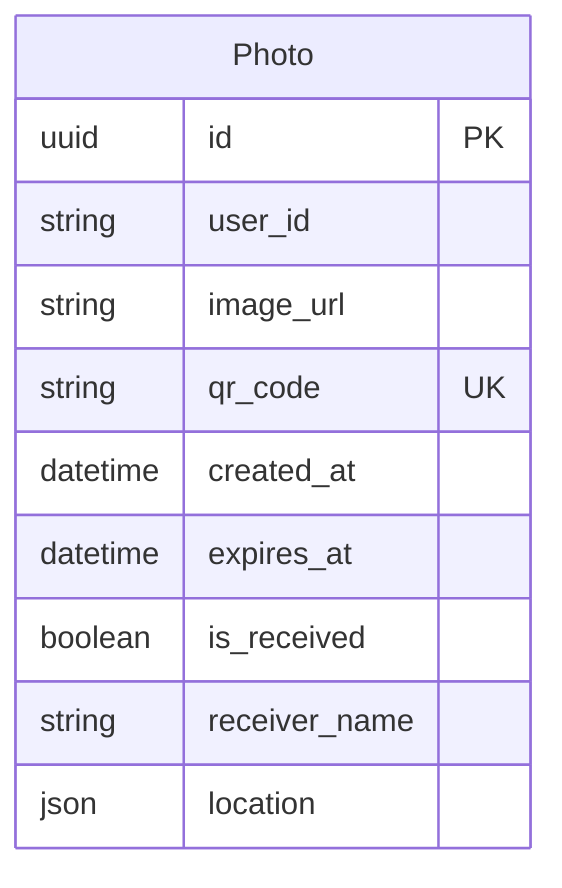

# 📸 ともだちチェキ（仮称）

出会いを特別な思い出に変える、チェキ風写真共有アプリ

[](https://nextjs.org/)
[](https://www.typescriptlang.org/)
[](https://www.prisma.io/)
[](LICENSE)

## 🎯 概要

TwoGate DevCamp2025 Summer 作品

## 🚀 デモ

[デモサイト](https://polaroid-kappa.vercel.app)

## 📦 インストール

### 前提条件

- Node.js
- npm
- Vercel アカウント（Neon ストレージ連携）
- Vercel CLI（`npm i -g vercel`）

### セットアップ手順

1. **リポジトリのクローン**

```bash
git clone git@github.com:nittc-wind/polaroid.git
cd polaroid
```

2. **依存関係のインストール**

```bash
npm install
```

3. **Vercel プロジェクトに接続（未接続の場合）**

```bash
vercel link
```

4. **環境変数を取得（Neon の DATABASE_URL など）**

```bash
vercel env pull .env.development.local
```

5. **開発サーバーの起動**

```bash
npm run dev
```

http://localhost:3000 でアプリケーションが起動します。

## 📁 プロジェクト構造

```
tomodachi-cheki/
├── prisma/
│   └── schema.prisma          # データベーススキーマ
├── public/                    # 静的ファイル
├── src/
│   ├── app/                   # Next.js App Router
│   │   ├── api/              # APIエンドポイント
│   │   │   ├── photos/       # 写真CRUD
│   │   │   ├── qr/          # QR生成・検証
│   │   │   └── receive/      # 受け取り処理
│   │   ├── camera/          # 撮影画面
│   │   ├── qr/[id]/         # QR表示画面
│   │   ├── photos/          # 写真一覧
│   │   ├── scan/            # QRスキャン
│   │   ├── receive/[id]/    # 情報入力
│   │   ├── develop/[id]/    # 現像画面
│   │   ├── complete/[id]/   # 完了画面
│   │   ├── layout.tsx       # 共通レイアウト
│   │   └── page.tsx         # ホーム画面
│   ├── components/          # 再利用可能なコンポーネント
│   │   ├── Camera.tsx       # カメラコンポーネント
│   │   ├── QRScanner.tsx    # QRスキャナー
│   │   ├── PhotoViewer.tsx  # 写真ビューアー
│   │   └── DevelopEffect.tsx # 現像エフェクト
│   ├── lib/                 # ユーティリティ
│   │   ├── prisma.ts       # Prismaクライアント
│   │   └── utils.ts        # 共通関数
│   └── types/              # TypeScript型定義
│       └── index.ts
├── .env.local              # 環境変数（Git管理外）
├── .gitignore
├── next.config.js          # Next.js設定
├── package.json
├── README.md
└── tsconfig.json          # TypeScript設定
```

## 🗄️ データベース設計



## 🧪 テスト

```bash
# ユニットテスト
npm run test

# E2Eテスト
npm run test:e2e

# テストカバレッジ
npm run test:coverage
```
